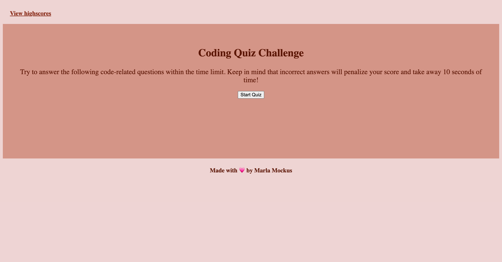

# Module 04 Challenge: code-quiz

## Description:

For week 4's challenge we were asked to make an intereactive quiz using CSS, HTML, and JavaScript. The project pushed our knowledge to dive even deeper into JavaScript. This project was definitly a challenge for me. I learned first and foremost how important breaks are. When youre reaching a point of confusion, go take a walk and revisit with a clear head! I learned so much during this project. Things like how to attach eventListeners to buttons, how to store scores locally in order to display a highscores board, setting up a timer, keeping a score board, prompts and subbmitting initials into a game, diving deeper into how the DOM functions, API's, and using append child to move documents nodes to new positions. 

[deployed site](https://mmockus15.github.io/code-quiz/)

Acceptance Criteria:

GIVEN I am taking a code quiz
WHEN I click the start button
THEN a timer starts and I am presented with a question
WHEN I answer a question
THEN I am presented with another question
WHEN I answer a question incorrectly
THEN time is subtracted from the clock
WHEN all questions are answered or the timer reaches 0
THEN the game is over
WHEN the game is over
THEN I can save my initials and my score